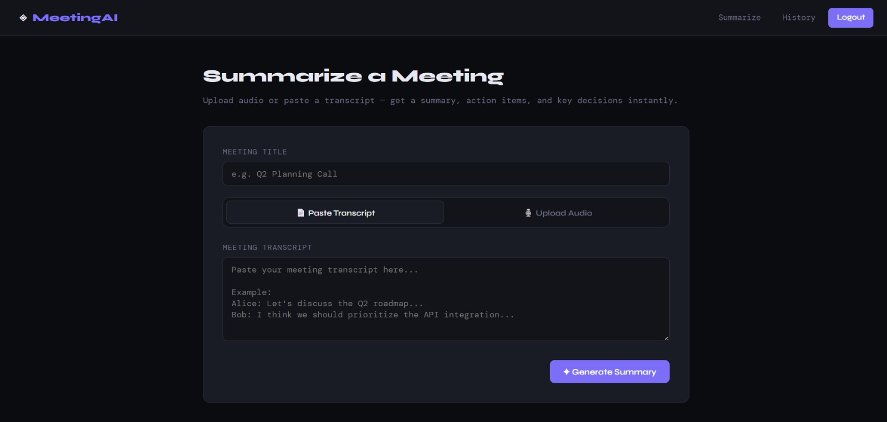
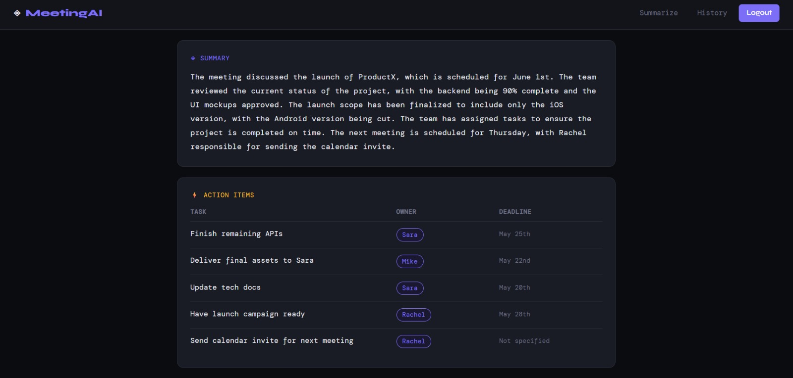
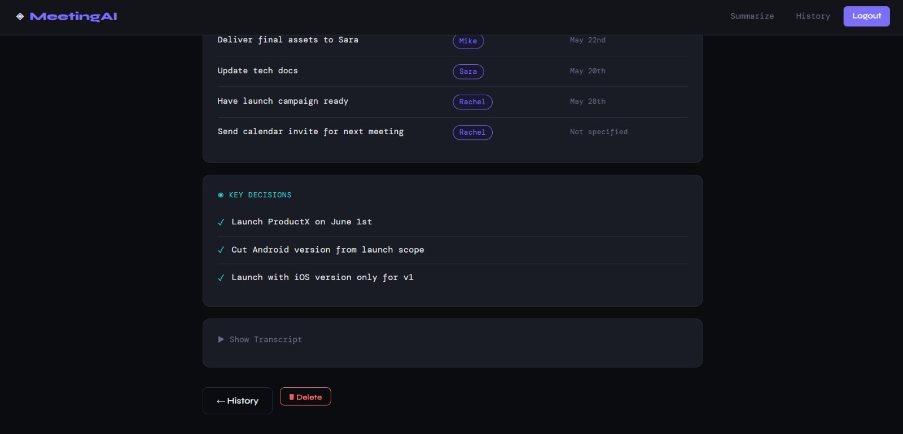
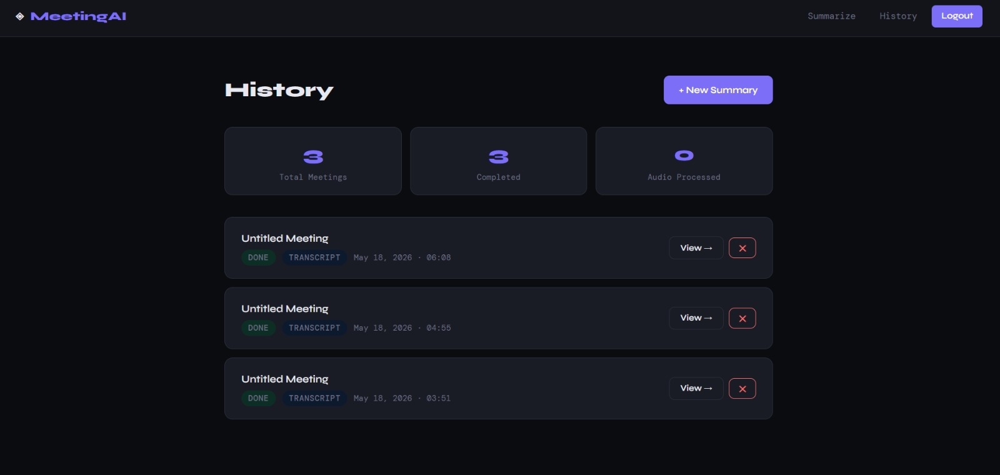

# Smart Meeting Summarizer 🎙️

An AI-powered meeting summarizer built with Flask and Groq (Llama 3.3). Upload audio or paste a transcript — get a structured summary, action items with owners & deadlines, and key decisions instantly.

## 🔗 Live Demo
**[smart-meeting-summarizer.onrender.com](https://smart-meeting-summarizer.onrender.com)**

## 📸 Screenshots

### Home — Summarize a Meeting


### Result — Summary, Action Items & Key Decisions (Part 1)


### Result — Key Decisions & Transcript Toggle (Part 2)


### History Dashboard


## ✨ Features
- 🎙️ Audio transcription via **faster-whisper** (tiny model, runs locally — free)
- 🤖 Structured AI summarization via **Groq (Llama 3.3-70b)**
- ✅ Action items with owner & deadline extraction
- 📋 Key decisions capture
- 🔐 User authentication (Flask-Login + Bcrypt)
- 📊 Meeting history dashboard with stats
- 🌑 Dark UI

## 🛠️ Tech Stack
- **Backend**: Flask, SQLAlchemy, Flask-Login, Flask-Bcrypt
- **AI/ML**: faster-whisper (Whisper tiny), Groq API (Llama 3.3-70b-versatile)
- **Database**: SQLite
- **Frontend**: Jinja2 templates, vanilla CSS/JS

## ⚙️ Setup

### 1. Clone and install dependencies
```bash
git clone https://github.com/kananiisha/Smart-Meeting-Summarizer.git
cd Smart-Meeting-Summarizer
pip install -r requirements.txt
```

### 2. Configure environment
```bash
cp env.example .env
```

Edit `.env`:
```
SECRET_KEY=your-secret-key-here
GROQ_API_KEY=your-groq-api-key-here
DATABASE_URL=sqlite:///meeting_summarizer.db
```

Get your free Groq API key at: [console.groq.com](https://console.groq.com)

### 3. Run the app
```bash
python run.py
```

Visit `http://localhost:5000`

## 🚀 How It Works
1. User registers/logs in
2. Paste a transcript OR upload audio (.mp3, .wav, .m4a, etc.)
3. If audio → transcribed locally using **faster-whisper** (no API cost)
4. Transcript → sent to **Groq API** with a structured prompt
5. Groq returns JSON: summary, action_items, key_decisions
6. Results stored in SQLite and displayed in a clean dark UI
7. Full meeting history with stats dashboard

## 📁 Project Structure
```
Smart-Meeting-Summarizer/
├── app/
│   ├── __init__.py       # Flask app factory
│   ├── models.py         # User + MeetingSummary models
│   ├── routes.py         # All routes
│   ├── summarizer.py     # Whisper + Groq pipeline
│   └── templates/
│       ├── base.html
│       ├── index.html
│       ├── result.html
│       ├── history.html
│       ├── login.html
│       └── register.html
├── screenshots/
├── config.py
├── run.py
├── requirements.txt
└── env.example
```